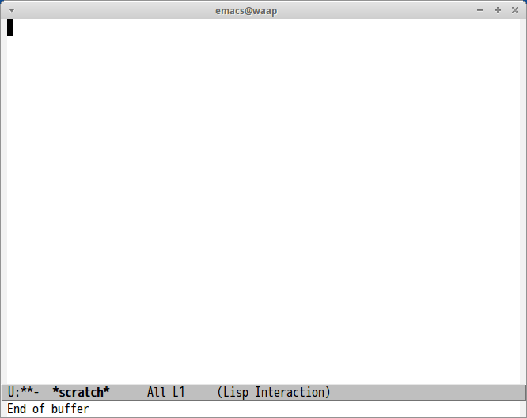

# emacs-mouko

This is a Emacs plugin for show NPB(Japanese professional baseball) game result.
This package is Emacs port of [vim-mouko](https://github.com/heavenshell/vim-mouko)

This package uses [Using NPB JSON API](https://github.com/p1ch-jp/BotchAPI)

## Screenshot

## Usage

#### `M-x mouko`

Show specified date result in header line
